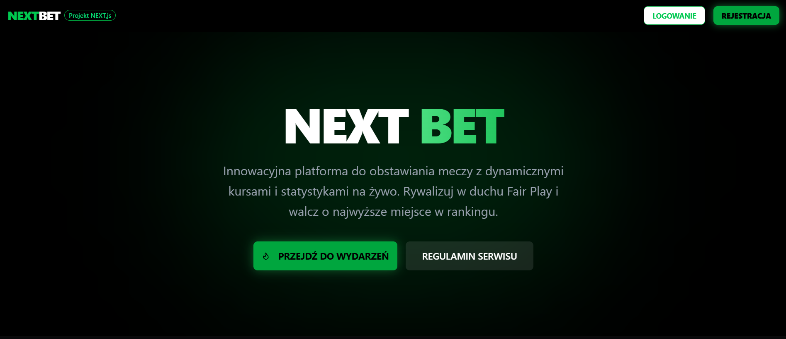

# NextBet



**NextBet** to nowoczesna aplikacja webowa do obstawiania wydarzeń sportowych, stworzona przy użyciu frameworka [Next.js](https://nextjs.org/) (bootstrapped with `create-next-app`). Projekt łączy dynamiczne zarządzanie meczami z intuicyjnym interfejsem użytkownika i integracją z bazą danych Supabase.

---

## Funkcje Projektu

### Moduły Użytkownika
* **System Zakładów (`betting-system`):** Obstawianie meczów.
* **Dashboard:** Podgląd postawionych kuponów (`user-coupons`) i historii zakładów.
* **Leaderboard:** Ranking najlepszych typerów w systemie.
* **Profil Gracza:** Zarządzanie kontem i statystykami użytkownika.

### Panel Administratora
* Zarządzanie bazą meczów, wynikami oraz użytkownikami.

---

## Technologie
* **Next.js**
* **React**
* **TypeScript**
* **Tailwind CSS**
* **tw-animate-css**
* **Supabase**
* **Server Actions**

### 1. Instalacja
Zainstaluj zależności (upewnij się, że masz Node.js):
```
npm install
```
### 2. Uruchomienie serwera deweloperskiego
Wpisz poniższą komendę w terminalu:
```
npm run dev
```

Otwórz http://localhost:3000 w przeglądarce, aby zobaczyć wynik. Możesz zacząć edytować stronę główną, modyfikując plik src/app/page.tsx.

### 3. Konfiguracja Środowiska
Upewnij się, że Twój plik .env zawiera niezbędne klucze do Supabase:
```
NEXT_PUBLIC_SUPABASE_URL=twoj_url
NEXT_PUBLIC_SUPABASE_ANON_KEY=twoj_klucz
```

---

## Struktura Projektu

Poniżej znajduje się odwzorowanie struktury plików w folderze `src`:
```
src/
├── app/                 # Routing aplikacji (App Router)
│   ├── admin/           # Panel administratora (actions.ts, page.tsx)
│   ├── dashboard/       # Panel główny użytkownika
│   ├── leaderboard/     # Strona rankingu
│   ├── login/           # Logowanie i rejestracja
│   ├── profile/         # Profil użytkownika
│   ├── layout.tsx       # Główny układ strony
│   └── page.tsx         # Strona startowa (Landing Page)
│
├── components/          # Komponenty React
│   ├── ui/              # Podstawowe elementy UI 
│   ├── betting-system.tsx # Logika systemu zakładów
│   └── user-coupons.tsx   # Komponent wyświetlania kuponów
│
├── lib/                 # Biblioteki pomocnicze
├── utils/               # Narzędzia (np. klient Supabase)
└── public/              # Zasoby statyczne (ikony, obrazy)
```